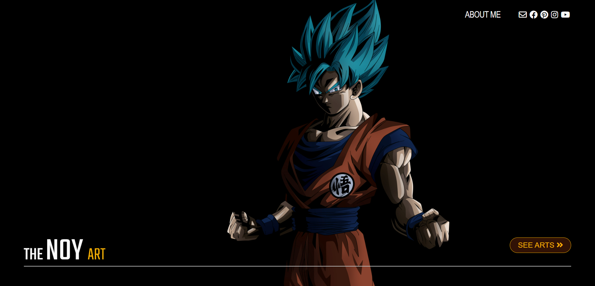
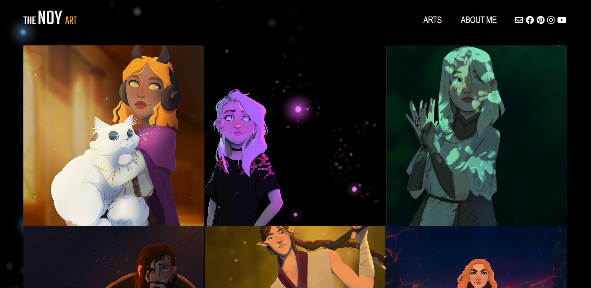
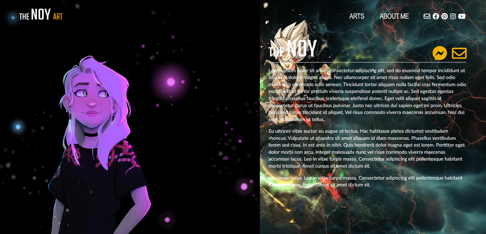
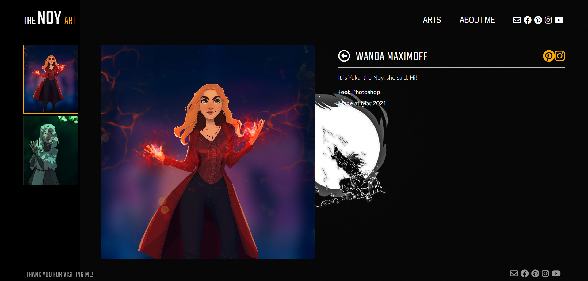

# Simple Portfolio of theNoy artworks

### Created using React with MaterialUI and Testing-Library
###
### Converted to Typescript

## Screenshots
||
|:--:|
|*Landing page*|

||
|:--:|
|*Gallery page*|

||
|:--:|
|*AboutMe view*|

||
|:--:|
|*Picture view*|

## Project Status

This project is currently in development. Users can found information of each artwork. Functionality to see create process, will be added in future.

> Still required:
>
> - 2 more artworks,
>
> - background art
>
> - hover improvment

## Installation and Setup Instructions

> Clone down this repository. You will need node and yarn installed globally on your machine.
>
> > Installation:
> >
> > yarn
>
> > To Run Test Suite:
> >
> > yarn test
>
> > To Start Server:
> >
> > yarn start
>
> > To Visit App:
> >
> > localhost:3000/ideas

## Reflection

This project was an exercise, helping me to understand TypeScript and familiarizing myself with documentation for new features.

Except for TypeScript I used here React, React-Router, Sass, Material, and Prettier.

This artbook are based on:

> npx create-react-app my-app --template typescript

Thank you for visiting :)
